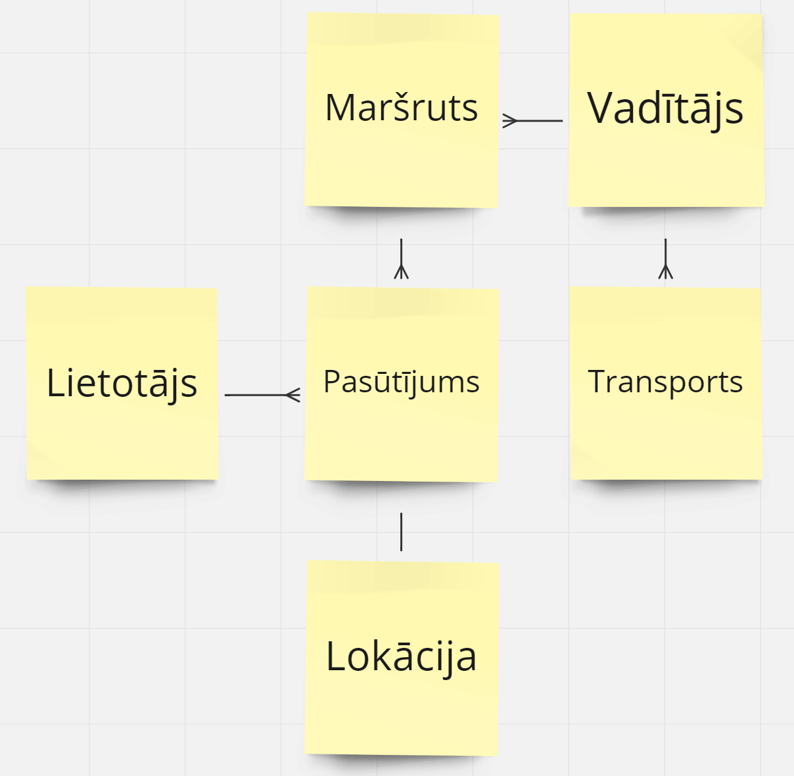
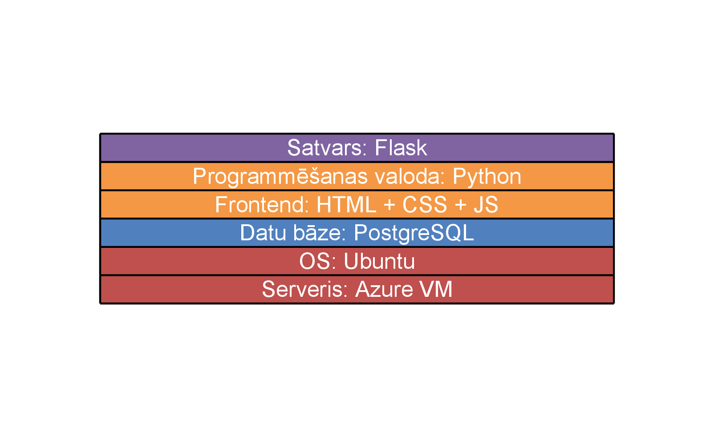

# Grouter

Preču piegādes maršrutēšana ar velo kurjeru
# Problēmas nostādne 

Mūsdienu pilsētu dzīve prasa efektīvas un ātras piegādes pakalpojumus. Lai nodrošinātu maksimālu efektivitāti, mūsu velo kurjeru piegādes sistēmai ir nepieciešama uzlabota maršrutu optimizācija.

# Darba un novērtēšanas mērķis

Nodrošināt ērti lietojamu mājaslapu, kur klienti spēj veikt pasūtījumus, kas tiks piegādāti uz norādīto vietu pēc iespējas īsākā laika periodā, vadītāji spēj pieteikties veikt pasūtījumus ar garantiju, ka tiek sniegta precīza informācija ar optimālāko maršrutu un kopējais pasūtījuma piegādes process ir dabai draudzīgs, neveicinot CO2 un/vai citu piesārņojumu izmešus.

-  Ātrākas piegādes:
Maršrutu optimizācija ļaus veidot īsākus un efektīvus maršrutus, samazinot piegādes laiku.

-  Efektīvāka resursu izmantošana:
Plānošanas algoritms ļaus optimizēt resursu izmantošanu, samazinot nepieciešamo laiku un izmaksas.

-  Palielināta klientu apmierinātība:
Pārredzama sistēma un ātra piegāde palielinās klientu apmierinātību un uzturēs lojalitāti.

# Līdzīgo risinājumu pārskats\*

| Nr.p.k. |       Nosaukums       | Apraksts                                                                                                                                                                                                                                                                                                                   | Atšķirība                                                          | Saīsne                                              |
| :-----: | :-------------------: | :------------------------------------------------------------------------------------------------------------------------------------------------------------------------------------------------------------------------------------------------------------------------------------------------------------------------- | :----------------------------------------------------------------- | :-------------------------------------------------- |
|    1    | Circuit Route Planner | Piedāvā maršruta plānošanu, kas klientiem sniedz informāciju par sūtījuma atrašanās vietu un piegādes laiku. Piedāvā arī pakalpojumu individuāliem šoferiem, lai izplānotu ikdienas braucienus.                                                                                                                            | Paredzēts vienam vadītājam.                                        | [getcircuit.com](https://getcircuit.com/)           |
|    2    |       Route4Me        | Piedāvā īpaši ātru plānošanu pēc copy-paste principa. Ļauj iekopēt sarakstu ar klientiem, vadītāju skaitu un 10 sekunžu laikā izvada maršrutu.                                                                                                                                                                             | Nepiedāvā velo maršruta plānošanu.                                 | [route4me.com](https://www.route4me.com/)           |
|    3    |      OptimoRoute      | OptimoRoute piedāvā reāllaika vadītāju un paku izsekošanu. Piedāvā arī mobilo aplikāciju gan iOS un Android lietotājiem, pieejama maršruta atjauninājumi un sūtījuma statuss. Viegli sinhronizējama ar citām sistēmām.                                                                                                     | Paredzēts vienam vadītājam.                                        | [optimoroute.com](https://optimoroute.com/)         |
|    4    |      Routesavvy       | RouteSavvy piedāvā automatizētu maršruta optimizāciju līdz pat 20 dažādiem transportlīdzekļiem un piedāvā līdz pat 300 pieturām.                                                                                                                                                                                           | Organizē maršrutus pa teritorijām                                  | [routesavvy.com](https://www.routesavvy.com/)       |
|    5    |     Myrouteonline     | Piedāvā augšupielādēt sarakstu līdz 350 adresēm un iegūt karti ar galapunktiem un optimizētu maršrutu vai izprintēt karti ar norādēm dažādās valodās.                                                                                                                                                                      | Nepiedāvā velo maršrutēšanu, maksimālais adrešu skaits - 350.      | [myrouteonline.com](https://www.myrouteonline.com/) |
|    6    |      Google Maps      | Piedāvā plašu informāciju par galapunktiem un iespējamajiem maršrutiem.                                                                                                                                                                                                                                                    | Google Maps nepieciešams manuāli sakārtiot pieturu secību.         | [google.com/maps](https://www.google.com/maps)      |
|    7    |         MapOn         | Mapon maršruta plānotājs nodrošina vispusīgu maršruta optimizāciju, ņemot vērā transportlīdzekļa veidu, ceļa maksu, satiksmi un citus faktorus. Maršruta plānotājs arī aprēķina maršrutus, balstoties uz transportlīdzekļa kravu un masu. Mapon arī nodrošina satiksmes informāciju reāllaikā un prognozē ierašanās laiku. | Nav paredzēts riteņbraukšanas maršruta plānošanā.                  | [mapon.com](https://www.mapon.com/en)               |
|    8    |        Impargo        | Impargo ir transporta vadības platforma autopārvadājumu dispečeriem. Tā piedāvā universālu loģistikas programmatūru ar kravas automašīnu maršrutu plānotāju, muitas kalkulatoru, pasūtījumu pārvaldību, DriverApp un citām integrācijām, lai digitalizētu transporta procesu.                                              | Paredzēts kravas automašīnu maršrutēšanai.                         | [impargo.de](https://impargo.de/en)                 |
|    9    |        Naviki         | Velo navigācijas rīks, kas palīdz atrast pimērotāko ceļu dažādiem velo braukšanas stiliem.                                                                                                                                                                                                                                 | Nepiedāvā maršruta optimizāciju ar vairākām nesakārtotām pieturām. | [naviki.org](https://www.naviki.org/en/)            |

- Tabulas izstrādē piedalījās visa grupa, rezultāts tika iesniegts no viena profila

# Lietotāju stāsti

| Nr.p.k. | Lietotāju stāsts                                                                                    | Prioritāte |
| :-----: | :-------------------------------------------------------------------------------------------------- | :--------: |
|    1    | Klients vēlas saņemt pasūtījumu, jo negrib braukt pakaļ pats                                        |   Augsta   |
|    2    | Vadītājs vēlas viegli pieejamu informāciju par maršrutu, jo viņam jāredz maršruts piegādes laikā    |   Augsta   |
|    3    | Vadītājs vēlas optimālu maršrutu, jo viņam jānogādā pasūtījumi pēc iespējas ātrāk                   |   Augsta   |
|    4    | Klients vēlas saņemt informāciju par pasūtījuma piegādes statusu, jo viņš grib zināt, kad to gaidīt |   Vidēja   |
|    5    | Klients vēlas, lai pasūtījums tiek piegādāts ar dabai draudzīgu transportu, jo klientam rūp vide    |   Vidēja   |

# Prasības
-  Sistēmai jāspēj reģistrēt pasūtījumu un to izgūt atrašanās vietu un klienta datus.
-  Vadītājam jāspēj iegūt detalizēta informācija par maršrutu, izmantojot karti mājaslapā.
-  Sistēmai jāspēj automātiski optimizēt maršrutus, ņemot vērā vairākus pasūtījumus un to prioritātes.
-  Optimizācijas algoritms jāveido, ņemot vērā piegādes laikus un attālumus.
-  Klientam jābūt iespējai sekot līdzi pasūtījuma piegādes statusam.

# Algoritms

1. Iegūt pasūtījumu un klientu informāciju:
   * Iegūt informāciju par visiem esošajiem pasūtījumiem un to adresēm.
3. Izveidot sākotnējo maršrutu:
   * Izveidot sākotnējo maršrutu, ņemot vērā visus pasūtījumus un to atrašanās vietas.
   * Minimizēt kopējo attālumu, ņemot vērā esošos pasūtījumus un to prioritātes.
  
4. Optimizēt maršrutu:
    * Izmantojot optimizācijas algoritmu, pielāgot maršrutu, lai minimizētu kopējo pārvietošanās attālumu.
Ņemt vērā piegādes laikus, lai nodrošinātu pasūtījumu piegādi laikā.

6. Aktualizēt maršrutu:
   * Aktualizēt maršrutu pēc katra pasūtījuma piegādes vai jauniem pasūtījumiem, kas ienāk sistēmā

# Konceptu Modelis

# Tehnoloģiju Steks

# Novērtējums

[Novērtēšanas plāns](https://docs.google.com/spreadsheets/d/1xjInoYII43EZXKQeMgyY6zE0TdriM8AhK8rrWZD4gLs/edit?usp=sharing)

# Secinājumi
